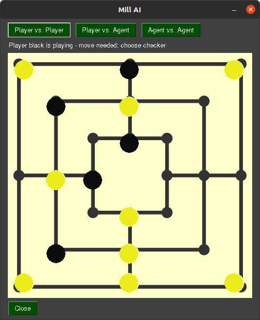

# MCTS for Mill

This is a school project that aims to learn the game of Mill, also known as Nine Mens Morris, with the Monte Carlo Tree
Search algorithm. It has been parallelized with multiprocessing.



## Table of Contents

* [How to install](#how-to-install)
* [Usage](#usage)
* [Technologies](#technologies)
* [Project Status](#project-status)
* [License](#license)
* [Other Methods](#other-methods)

## How to install

To use this project, first clone the repo on your device using the command below:

`git clone -b mcts https://github.com/42kangaroo/Muele_AI.git`

Then, change to the directory and install the dependencies:

```
cd Muele_AI
pip install -r requirements.txt
```

## Usage

When you open the file [`Graphics.py`](Graphics.py) you will find this line at the end of the file:

```python
MCGraphics = ModeratedGraphics(gamma=0.9, max_depth=12, num_sims=750)
MCGraphics.playLoop()
```

The gamma parameter defines the weight given to future mills, the max_depth parameter stands for the maximum depth of
the search tree, and num_sims is the number of simulations for each valid move. You can change these parameters as you
wish.

You can then start the program with

`py Graphics.py`

## Technologies

I used these libraries for my project.

* [Python](https://www.python.org/) 3.7
* [numpy](https://numpy.org/) 1.18.5
* [PySimpleGui](https://pysimplegui.readthedocs.io/en/latest/) 4.34.0
* [multiprocessing](https://docs.python.org/3.8/library/multiprocessing.html)

## Project Status

The MCTS works and plays a good game, but it's very slow. So I implemented AlphaZero to have a better AI.
See [Other Methods](#other-methods)

## License

This project is licensed under the [GNU General Public License v3.0](LICENSE)

## Other Methods

I also tried to learn the game of Mill with MCTS and Reinforcement learning.
See [AlphaZero](https://github.com/42kangaroo/Muele_AI/tree/alphaZero)
and [Reinforce](https://github.com/42kangaroo/Muele_AI/tree/reinforce) branch.